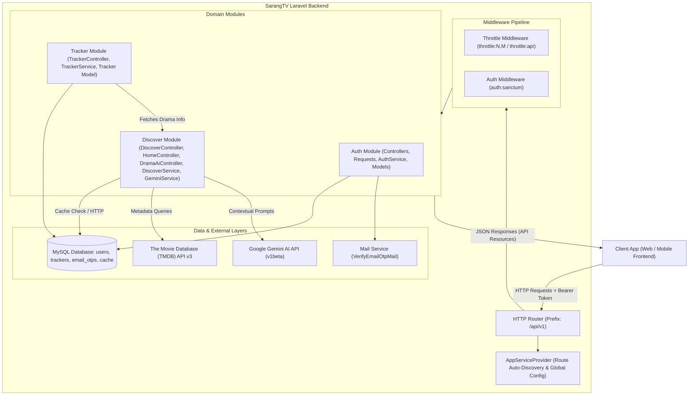
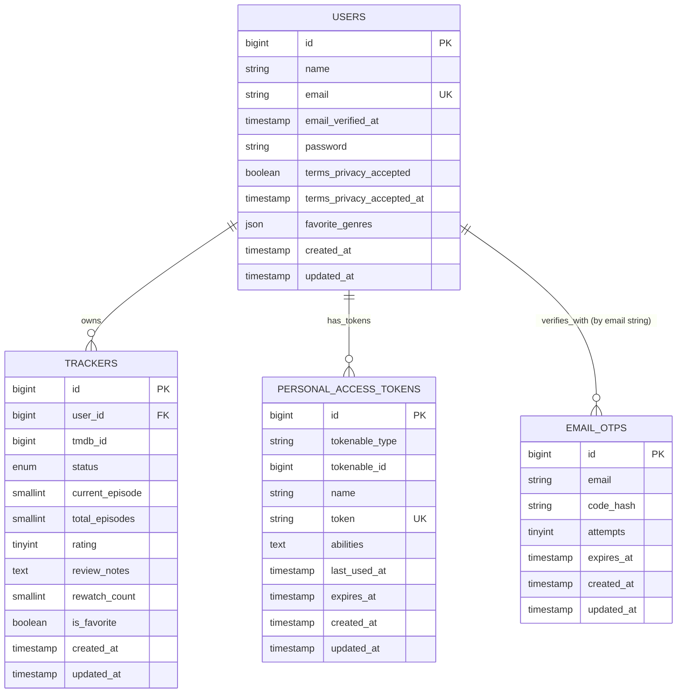
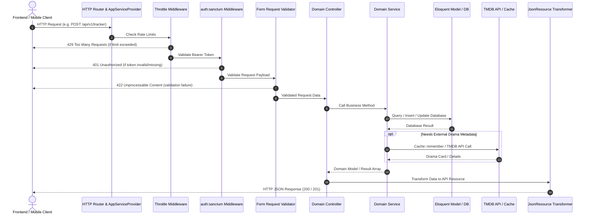
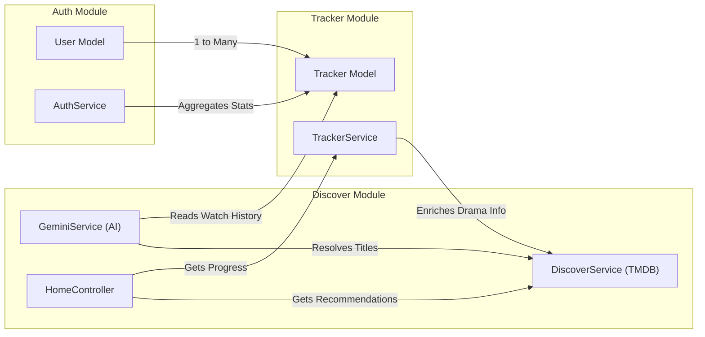
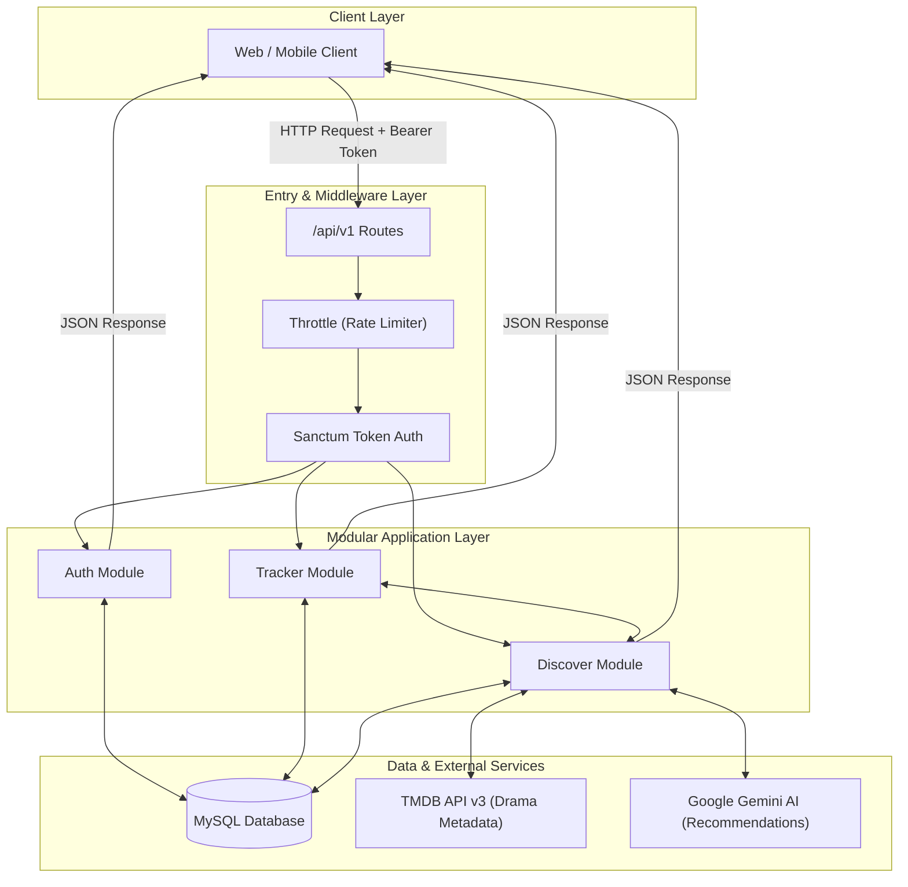

# Backend Module Documentation — SarangTV API

> Backend Architecture and Logic Documentation for SarangTV

This document provides a complete, beginner-friendly guide to the Laravel backend implementation of SarangTV. It explains the backend architecture, modules, database schema, request lifecycle, business logic, API endpoints, and relationships between components.

---

## Table of Contents

- [1. Backend Overview](#1-backend-overview)
- [2. Directory Structure](#2-directory-structure)
- [3. API Route Documentation](#3-api-route-documentation)
- [4. Controller Documentation](#4-controller-documentation)
- [5. Model Documentation](#5-model-documentation)
- [6. Database Documentation](#6-database-documentation)
- [7. Entity Relationship Overview](#7-entity-relationship-overview)
- [8. Request Lifecycle](#8-request-lifecycle)
- [9. Authentication](#9-authentication)
- [10. Validation Logic](#10-validation-logic)
- [11. Business Rules](#11-business-rules)
- [12. Service Layer](#12-service-layer)
- [13. Middleware](#13-middleware)
- [14. Authorization](#14-authorization)
- [15. API Resources and Response Formatting](#15-api-resources-and-response-formatting)
- [16. Error Handling](#16-error-handling)
- [17. Search, Filter, Sort, and Pagination](#17-search-filter-sort-and-pagination)
- [18. File and Image Handling](#18-file-and-image-handling)
- [19. External Services and APIs](#19-external-services-and-apis)
- [20. Module-by-Module Documentation](#20-module-by-module-documentation)
- [21. Cross-Module Relationships](#21-cross-module-relationships)
- [22. Important Code Walkthroughs](#22-important-code-walkthroughs)
- [23. Database Transactions](#23-database-transactions)
- [24. Eloquent Query Patterns](#24-eloquent-query-patterns)
- [25. Security Considerations](#25-security-considerations)
- [26. Environment and Configuration](#26-environment-and-configuration)
- [27. Seeders and Factories](#27-seeders-and-factories)
- [28. Backend Setup Overview](#28-backend-setup-overview)
- [29. Beginner Glossary](#29-beginner-glossary)
- [30. Final Architecture Summary](#30-final-architecture-summary)

---

## 1. Backend Overview

### 1.1 Purpose & Responsibilities
The SarangTV backend is a RESTful API powering the SarangTV Korean Drama tracking and discovery platform. It is responsible for:
1. **User Identity & Security**: User registration, credential authentication, single-use email One-Time Password (OTP) verification, session revocation, and password recovery via Laravel Sanctum.
2. **K-Drama Catalog Integration**: Real-time integration with The Movie Database (TMDB) API v3 to search, filter, and fetch rich metadata for Korean television series (posters, backdrops, episode listings, trailers, and cast credits) without maintaining a bloated static local drama catalog.
3. **Personalized Watch Tracking**: Managing individual drama watch status (`watching`, `completed`, `plan_to_watch`, `on_hold`, `dropped`), episode progress increments, rewatch counters, 1–10 star ratings, personal notes, and favorites.
4. **AI-Powered Recommendation Chatbot**: Integrating Google Gemini AI models to generate personalized, context-aware, spoiler-free K-drama recommendations grounded in the user's active watchlist, completed dramas, and preferred genres.
5. **Dashboard Analytics**: Computing real-time aggregation of watch statistics (total dramas, episodes watched, hours spent, average ratings, and status distributions) for home and profile screens.

### 1.2 Technology Stack & Dependencies
- **Framework**: Laravel 12 / 13 skeleton (`"laravel/framework": "^13.17"`)
- **PHP Version**: `^8.3`
- **Authentication**: Laravel Sanctum (`"laravel/sanctum": "^4.0"`)
- **Interactive Shell / REPL**: Laravel Tinker (`"laravel/tinker": "^3.0"`)
- **External APIs**:
  - The Movie Database (TMDB) API v3
  - Google Gemini Generative Language API (`v1beta`)
- **Database Engine**: MySQL / MariaDB (configurable via `.env`)
- **Cache Engine**: Database cache table (`cache`) with a 24-hour TTL for external TMDB API requests
- **Mail Engine**: SMTP / Log mailer dispatching customized Blade OTP verification emails

### 1.3 Architectural Style: Modular Monolith
Unlike standard Laravel setups where all controllers reside in `app/Http/Controllers` and all models reside in `app/Models`, SarangTV adopts a **Modular Monolith** architecture. Application features are partitioned into high-cohesion, self-contained domain modules located in `app/Modules/`:
- **`Auth` Module**: User account management, email OTP generation/verification, profile preferences, and Sanctum token life cycle.
- **`Discover` Module**: TMDB API integration, genre resolution, keyword/actor search, and Gemini AI chatbot recommendations.
- **`Tracker` Module**: Watchlist records, episode tracking, status transitions, review notes, and metadata enrichment.

Each module organizes its own routes, controllers, form requests, Eloquent models, services, resources, and mailables.

### 1.4 High-Level Architecture Diagram



---

## 2. Directory Structure

The SarangTV backend repository structure clearly separates infrastructure configuration from business modules:

```text
backend/
├── app/
│   ├── Http/
│   │   └── Controllers/
│   │       └── Controller.php                  # Base Laravel Controller class
│   ├── Modules/
│   │   ├── Auth/                               # Auth & User Profile Domain
│   │   │   ├── Controllers/
│   │   │   │   └── AuthController.php          # 15 authentication & profile endpoints
│   │   │   ├── Mail/
│   │   │   │   └── VerifyEmailOtpMail.php      # 6-digit OTP verification email mailable
│   │   │   ├── Models/
│   │   │   │   ├── EmailOtp.php                # OTP code hashing & expiration model
│   │   │   │   └── User.php                    # User identity & Sanctum authenticatable model
│   │   │   ├── Requests/                       # Dedicated Form Requests
│   │   │   │   ├── ChangePasswordRequest.php
│   │   │   │   ├── DeleteAccountRequest.php
│   │   │   │   ├── ForgotPasswordRequest.php
│   │   │   │   ├── LoginRequest.php
│   │   │   │   ├── RegisterRequest.php
│   │   │   │   ├── ResendOtpRequest.php
│   │   │   │   ├── ResetPasswordRequest.php
│   │   │   │   ├── SendSignupOtpRequest.php
│   │   │   │   ├── UpdatePasswordRequest.php
│   │   │   │   └── VerifyOtpRequest.php
│   │   │   ├── Resources/
│   │   │   │   └── UserResource.php            # Sanitized user JSON transformer
│   │   │   ├── Routes/
│   │   │   │   └── api.php                     # Route definitions for /auth and /user
│   │   │   └── Services/
│   │   │       └── AuthService.php             # Core authentication, OTP, and user business logic
│   │   ├── Discover/                           # Drama Catalog & AI Recommendation Domain
│   │   │   ├── Controllers/
│   │   │   │   ├── DiscoverController.php      # Browse, search, genres, drama details
│   │   │   │   ├── DramaAiController.php       # AI recommendation assistant chatbot
│   │   │   │   └── HomeController.php          # Aggregated dashboard metrics & recommendations
│   │   │   ├── Requests/
│   │   │   │   ├── AskChatbotRequest.php       # AI chatbot prompt validation
│   │   │   │   ├── DiscoverRequest.php         # Genre and page discovery validation
│   │   │   │   └── SearchRequest.php           # Query validation
│   │   │   ├── Resources/
│   │   │   │   ├── DramaCardResource.php       # Compact drama card JSON transformer
│   │   │   │   └── DramaDetailResource.php     # Full drama detail (seasons, trailer, cast) transformer
│   │   │   ├── Routes/
│   │   │   │   └── api.php                     # Route definitions for /discover and /home
│   │   │   └── Services/
│   │   │       ├── DiscoverService.php         # TMDB HTTP integration, caching & multi-pass search
│   │   │       └── GeminiService.php           # Gemini AI prompting with user watch history context
│   │   └── Tracker/                            # Watchlist & Progress Domain
│   │       ├── Controllers/
│   │       │   └── TrackerController.php       # CRUD operations for watch tracking
│   │       ├── Models/
│   │       │   └── Tracker.php                 # User watchlist Eloquent model
│   │       ├── Requests/
│   │       │   ├── FilterTrackerRequest.php    # Status and favorite filter validation
│   │       │   ├── StoreTrackerRequest.php     # Add drama validation & episode boundary rule
│   │       │   └── UpdateTrackerRequest.php   # Update progress validation & episode boundary rule
│   │       ├── Resources/
│   │       │   ├── TrackerCardResource.php     # Tracker list item with enriched drama card
│   │       │   └── TrackerDetailResource.php   # Detailed tracker item with full metadata
│   │       ├── Routes/
│   │       │   └── api.php                     # Route definitions for /tracker
│   │       └── Services/
│   │           └── TrackerService.php          # Tracker persistence, transitions & TMDB enrichment
│   └── Providers/
│       └── AppServiceProvider.php              # Global bootstrap: rate limiters, password rules, module route discovery
├── bootstrap/
│   └── app.php                                 # Application setup, routing paths & JSON exception enforcement
├── config/
│   ├── auth.php                                # Guards, providers (points to App\Modules\Auth\Models\User), password brokers
│   ├── cache.php                               # Cache store settings (defaults to database table)
│   ├── database.php                            # MySQL database connection settings
│   ├── services.php                            # Third-party configurations: TMDB and Gemini credentials
│   └── session.php                             # Session drivers and lifetime
├── database/
│   ├── factories/
│   │   └── UserFactory.php                     # User model test data factory
│   ├── migrations/                             # 9 database schema migrations
│   └── seeders/
│       └── DatabaseSeeder.php                  # Base database seeder with default test user
├── resources/
│   └── views/
│       └── emails/
│           └── verify-otp.blade.php            # HTML email template for 6-digit OTP codes
└── routes/
    ├── api.php                                 # Root fallback API route (GET /api/user)
    ├── console.php                             # Artisan console command definitions
    └── web.php                                 # Root web route (GET /)
```

---

## 3. API Route Documentation

All module API endpoints are registered via `AppServiceProvider` under the global prefix:
```text
/api/v1
```

### 3.1 Endpoint Summary Table

| HTTP Method | Endpoint URI | Controller & Method | Auth Required | Throttling | Purpose |
| :--- | :--- | :--- | :--- | :--- | :--- |
| `POST` | `/api/v1/auth/send-signup-otp` | `AuthController@sendSignupOtp` | Public | `throttle:5,1` | Generate and email 6-digit registration OTP code |
| `POST` | `/api/v1/auth/register` | `AuthController@register` | Public | `throttle:10,1` | Register user (supports in-form OTP verification) |
| `POST` | `/api/v1/auth/verify-otp` | `AuthController@verifyOtp` | Public | `throttle:6,1` | Verify email OTP and issue initial Sanctum token |
| `POST` | `/api/v1/auth/resend-otp` | `AuthController@resendOtp` | Public | `throttle:3,1` | Resend fresh OTP code with 60-second cooldown |
| `POST` | `/api/v1/auth/login` | `AuthController@login` | Public | `throttle:6,1` | Authenticate credentials and issue Sanctum token |
| `POST` | `/api/v1/auth/forgot-password` | `AuthController@forgotPassword` | Public | `throttle:6,1` | Dispatch password reset email link |
| `POST` | `/api/v1/auth/reset-password` | `AuthController@resetPassword` | Public | `throttle:6,1` | Reset password using email reset token |
| `GET` | `/api/v1/auth/me` | `AuthController@me` | Yes (`Bearer`) | None | Retrieve authenticated user profile |
| `PATCH` | `/api/v1/auth/password` | `AuthController@updatePassword` | Yes (`Bearer`) | None | Update authenticated user password |
| `POST` | `/api/v1/auth/change-password` | `AuthController@changePassword` | Yes (`Bearer`) | None | Change authenticated user password |
| `POST` | `/api/v1/auth/logout` | `AuthController@logout` | Yes (`Bearer`) | None | Revoke active Sanctum access token |
| `POST` | `/api/v1/auth/logout-all` | `AuthController@logoutAll` | Yes (`Bearer`) | None | Revoke all active tokens across devices |
| `GET` | `/api/v1/user/profile` | `AuthController@profile` | Yes (`Bearer`) | None | Retrieve user profile with aggregated watch stats |
| `PUT` | `/api/v1/user/profile` | `AuthController@updateProfile` | Yes (`Bearer`) | None | Update user display name and avatar URL |
| `POST` | `/api/v1/user/email/request-change`| `AuthController@requestEmailChange`| Yes (`Bearer`) | `throttle:5,1` | Initiate email address change (sends OTP) |
| `POST` | `/api/v1/user/email/verify-change` | `AuthController@verifyEmailChange` | Yes (`Bearer`) | `throttle:6,1` | Finalize email update with 6-digit OTP code |
| `PATCH` | `/api/v1/user/preferences` | `AuthController@updatePreferences` | Yes (`Bearer`) | None | Update favorite genre list and avatar URL |
| `GET` | `/api/v1/user/stats` | `AuthController@stats` | Yes (`Bearer`) | None | Retrieve aggregated drama watch metrics |
| `PUT` | `/api/v1/user/password` | `AuthController@updatePassword` | Yes (`Bearer`) | None | Update password (REST alias) |
| `DELETE` | `/api/v1/user` | `AuthController@deleteAccount` | Yes (`Bearer`) | None | Permanently delete user account and trackers |
| `GET` | `/api/v1/home` | `HomeController@index` | Yes (`Bearer`) | None | Aggregated dashboard: greeting, stats, watching, recommendations |
| `GET` | `/api/v1/discover` | `DiscoverController@index` | Yes (`Bearer`) | None | Discover K-dramas with genre filter or query search fallback |
| `GET` | `/api/v1/discover/genres` | `DiscoverController@genres` | Yes (`Bearer`) | None | List all TMDB television genres |
| `GET` | `/api/v1/discover/search` | `DiscoverController@search` | Yes (`Bearer`) | None | Multi-pass search K-dramas by title, actor, or keyword |
| `POST` | `/api/v1/discover/chatbot` | `DramaAiController@recommend` | Yes (`Bearer`) | `throttle:api` | AI recommendation assistant powered by Gemini |
| `GET` | `/api/v1/discover/{tmdb_id}` | `DiscoverController@show` | Yes (`Bearer`) | None | Full drama detail (seasons, trailer, cast, watch status) |
| `GET` | `/api/v1/tracker` | `TrackerController@index` | Yes (`Bearer`) | None | List user's tracked dramas with status/favorite filter |
| `POST` | `/api/v1/tracker` | `TrackerController@store` | Yes (`Bearer`) | None | Add drama to tracker |
| `GET` | `/api/v1/tracker/{tmdb_id}` | `TrackerController@show` | Yes (`Bearer`) | None | Retrieve detailed tracker state and drama metadata |
| `PATCH` | `/api/v1/tracker/{tmdb_id}` | `TrackerController@update` | Yes (`Bearer`) | None | Update episode progress, status, rating, or notes |
| `POST` | `/api/v1/tracker/{tmdb_id}/increment` | `TrackerController@increment` | Yes (`Bearer`) | None | Increment episode progress by +1 with auto-completion |
| `DELETE` | `/api/v1/tracker/{tmdb_id}` | `TrackerController@destroy` | Yes (`Bearer`) | None | Remove drama from user tracker |

---

## 4. Controller Documentation

### 4.1 `AuthController`
- **File**: `app/Modules/Auth/Controllers/AuthController.php`
- **Dependencies**: `App\Modules\Auth\Services\AuthService`
- **Purpose**: Manages user registration, login, token revocation, profile settings, and email OTP verification.

#### Methods:
1. **`sendSignupOtp(SendSignupOtpRequest $request): JsonResponse`**
   - Validates user email and optional name.
   - Enforces a 60-second cooldown if an OTP was recently sent.
   - Generates a 6-digit numeric OTP, hashes it via `Hash::make()`, stores it in `email_otps`, and emails it using `VerifyEmailOtpMail`.
   - Returns: `{ "message": "Verification code sent to your email." }` (`200 OK`).

2. **`register(RegisterRequest $request): JsonResponse`**
   - **In-Form OTP Flow**: If the client supplies an `otp` parameter, `AuthService` verifies the OTP code against `email_otps`. If valid, it creates the user immediately with `email_verified_at = now()`, issues a Sanctum plain text token, and returns HTTP `201 Created` with `requires_verification = false`.
   - **Two-Step Flow**: If no OTP is passed, it creates an unverified user record, generates and dispatches an OTP email, and returns HTTP `201 Created` with `requires_verification = true`.

3. **`verifyOtp(VerifyOtpRequest $request): JsonResponse`**
   - Checks code expiration (10 minutes) and verification attempt limit (max 5 attempts).
   - Validates OTP hash with `Hash::check()`.
   - On success, deletes the OTP record, sets `users.email_verified_at = now()`, and issues a Sanctum access token.

4. **`resendOtp(ResendOtpRequest $request): JsonResponse`**
   - Verifies the user exists and is unverified.
   - Applies the 60-second rate-limit cooldown.
   - Generates and emails a new 6-digit OTP code.

5. **`login(LoginRequest $request): JsonResponse`**
   - Validates credentials against `users` password hash.
   - Rejects unverified accounts with HTTP `422` error: *"Your email address has not been verified."*
   - Generates a new Sanctum token and returns the authenticated user object.

6. **`me(Request $request): JsonResponse`**
   - Returns the authenticated user wrapped in `UserResource`.

7. **`profile(Request $request): JsonResponse`**
   - Returns user details alongside aggregated tracker statistics (`total_dramas`, `episodes_watched`, `hours_watched`, `average_rating`, `status_breakdown`).

8. **`updateProfile(Request $request): JsonResponse`**
   - Validates `name` (max 50 chars) and `avatar_url`.
   - Updates the user record and returns the updated `UserResource`.

9. **`requestEmailChange(Request $request): JsonResponse`**
   - Requires the current password to authenticate the user before initiating the change.
   - Checks that the new email is not already in use.
   - Sends a 6-digit OTP code to the requested new email address.

10. **`verifyEmailChange(Request $request): JsonResponse`**
    - Verifies the 6-digit OTP for the new email address.
    - Updates `users.email` and refreshes `email_verified_at = now()`.

11. **`updatePreferences(Request $request): JsonResponse`**
    - Validates `favorite_genres` (array of strings) and `avatar_url`.
    - Updates the user model and returns `UserResource`.

12. **`stats(Request $request): JsonResponse`**
    - Directly retrieves aggregated watchlist metrics from `AuthService::getUserStats()`.

13. **`logout(Request $request): JsonResponse`**
    - Revokes only the token used to authenticate the current request (`$user->currentAccessToken()->delete()`).

14. **`logoutAll(Request $request): JsonResponse`**
    - Revokes all active tokens for the user across all devices (`$user->tokens()->delete()`).

15. **`forgotPassword(ForgotPasswordRequest $request): JsonResponse`**
    - Dispatches a standard Laravel password broker reset link.

16. **`resetPassword(ResetPasswordRequest $request): JsonResponse`**
    - Validates reset token and updates password hash. Revokes existing tokens for security.

17. **`changePassword(ChangePasswordRequest $request): JsonResponse`** / **`updatePassword(UpdatePasswordRequest $request): JsonResponse`**
    - Validates `current_password` and sets a new confirmed password matching default security criteria.

18. **`deleteAccount(DeleteAccountRequest $request): JsonResponse`**
    - Validates `current_password`, clears OTP records, revokes all Sanctum tokens, and deletes the `users` row. The foreign key constraint cascades deletions to all associated `trackers`.

---

### 4.2 `DiscoverController`
- **File**: `app/Modules/Discover/Controllers/DiscoverController.php`
- **Dependencies**: `App\Modules\Discover\Services\DiscoverService`
- **Purpose**: Proxies and formats K-Drama discovery, television genres, search, and detailed show information from TMDB.

#### Methods:
1. **`index(DiscoverRequest $request): JsonResponse`**
   - Checks if a search keyword is provided (`query` or `search`). If present, routes dynamically to search logic.
   - Otherwise, invokes `DiscoverService::discover()` applying filters for South Korean TV dramas (`with_origin_country=KR`, `with_original_language=ko`, `with_genres=18,...`).
   - Appends the authenticated user's current watch status for each drama card.
   - Returns paginated data wrapped in `DramaCardResource`.

2. **`genres(): JsonResponse`**
   - Retrieves the full list of TMDB television genres cached for 24 hours (`86400` seconds).

3. **`search(SearchRequest $request): JsonResponse`**
   - Executes multi-pass search matching titles, actor credits, and themed keywords.
   - Returns results formatted with `DramaCardResource`.

4. **`show(Request $request, int $tmdb_id): JsonResponse`**
   - Retrieves complete television metadata from TMDB, appending `videos` and `credits`.
   - Appends user's current watch status (`getWatchStatus($tmdb_id, $user)`).
   - Returns the structured response transformed via `DramaDetailResource`.

---

### 4.3 `HomeController`
- **File**: `app/Modules/Discover/Controllers/HomeController.php`
- **Dependencies**: `TrackerService`, `DiscoverService`
- **Purpose**: Aggregates all dashboard metrics into a single request for smooth mobile/web initial loading.

#### Method `index(Request $request): JsonResponse` Logic Flow:
1. **Greeting**: Extracts user name for personalized greeting.
2. **Watch Statistics**: Performs a single SQL query on `trackers` aggregating:
   - `listed`: Total dramas tracked.
   - `watching`: Count where `status = 'watching'`.
   - `completed`: Count where `status = 'completed'`.
   - `hours_watched`: Rounded sum of watched episodes.
3. **Currently Watching Item**: Queries the most recently updated tracker where `status = 'watching'`. Enriches it with TMDB metadata, episode runtimes, and progress calculations.
4. **Smart Recommendations**:
   - Reads user's `favorite_genres` array.
   - Translates genre names to TMDB television genre IDs (e.g. Comedy $\rightarrow$ 35, Mystery $\rightarrow$ 9648, Action $\rightarrow$ 10759, Romance $\rightarrow$ authentic TMDB Romance keyword `9840`).
   - Fetches drama pools for each genre and interleaves recommendations round-robin to ensure balanced variety.
   - Falls back to general popularity discovery if no user preferences are configured.

---

### 4.4 `DramaAiController`
- **File**: `app/Modules/Discover/Controllers/DramaAiController.php`
- **Dependencies**: `App\Modules\Discover\Services\GeminiService`
- **Purpose**: Handles AI recommendation chatbot interactions.

#### Method `recommend(AskChatbotRequest $request): JsonResponse`:
1. Validates incoming user message (`required|string|min:2|max:500`).
2. Calls `GeminiService::askRecommendation($user, $message)`.
3. Returns `{ "reply": "..." }`.

---

### 4.5 `TrackerController`
- **File**: `app/Modules/Tracker/Controllers/TrackerController.php`
- **Dependencies**: `App\Modules\Tracker\Services\TrackerService`
- **Purpose**: Provides full CRUD and progress management for the user's personal drama watchlist.

#### Methods:
1. **`index(FilterTrackerRequest $request): JsonResponse`**
   - Filters user trackers by `status` (`watching`, `completed`, etc.) and `favorite` flag.
   - Paginates results (default 20 per page).
   - Enriches each record with cached TMDB drama card metadata.
   - Appends total count breakdowns across all status categories.
   - Formats records using `TrackerCardResource`.

2. **`show(Request $request, int $tmdb_id): JsonResponse`**
   - Retrieves the user's tracker record for the given TMDB drama ID.
   - Enriches the record with full TMDB details and season episodes.
   - Returns data transformed via `TrackerDetailResource`.

3. **`store(StoreTrackerRequest $request): JsonResponse`**
   - Prevents duplicate tracking of the same drama.
   - If `total_episodes` is omitted, fetches total episode count automatically from TMDB.
   - Enforces constraint: `current_episode <= total_episodes`.
   - Automatically promotes status to `completed` if `current_episode >= total_episodes`.
   - Returns HTTP `201 Created` with `TrackerDetailResource`.

4. **`update(UpdateTrackerRequest $request, int $tmdb_id): JsonResponse`**
   - Updates progress, status, rating, personal notes, rewatch count, or favorite toggle.
   - Automatically handles status transitions when progress changes (e.g. transitioning from `plan_to_watch` to `watching` when episode progress $> 0$).

5. **`increment(Request $request, int $tmdb_id): JsonResponse`**
   - Increments `current_episode` by $+1$.
   - Validates that progress does not exceed `total_episodes`.
   - If the increment reaches `total_episodes`, automatically marks the drama as `completed`.

6. **`destroy(Request $request, int $tmdb_id): JsonResponse`**
   - Deletes the tracker row from the database.
   - Returns confirmation message: `"Drama removed from tracker successfully."`

---

## 5. Model Documentation

### 5.1 `User`
- **Class**: `App\Modules\Auth\Models\User`
- **File**: `app/Modules/Auth/Models/User.php`
- **Database Table**: `users`
- **Traits**: `HasApiTokens`, `HasFactory`, `Notifiable`
- **PHP 8 Attributes**:
  - `#[Fillable(['name', 'email', 'password', 'email_verified_at', 'terms_privacy_accepted', 'terms_privacy_accepted_at', 'favorite_genres'])]`
  - `#[Hidden(['password', 'remember_token'])]`

#### Attribute Casts:
```php
protected function casts(): array
{
    return [
        'email_verified_at'          => 'datetime',
        'password'                   => 'hashed',
        'terms_privacy_accepted'    => 'boolean',
        'terms_privacy_accepted_at' => 'datetime',
        'favorite_genres'           => 'array',
    ];
}
```

#### Relationships:
- **`trackers()`**: `hasMany(Tracker::class)`
  - Returns all drama watchlist records owned by the user.

---

### 5.2 `EmailOtp`
- **Class**: `App\Modules\Auth\Models\EmailOtp`
- **File**: `app/Modules/Auth/Models/EmailOtp.php`
- **Database Table**: `email_otps`
- **Traits**: `HasFactory`
- **PHP 8 Attributes**:
  - `#[Fillable(['email', 'code_hash', 'attempts', 'expires_at'])]`

#### Attribute Casts:
```php
protected function casts(): array
{
    return [
        'expires_at' => 'datetime',
        'attempts'   => 'integer',
    ];
}
```

#### Custom Methods:
- **`isExpired(): bool`**: Returns `true` if `expires_at` is past the current timestamp.
- **`hasExceededMaxAttempts(int $max = 5): bool`**: Returns `true` if `attempts >= $max` (used to prevent brute-force attacks on OTP codes).

---

### 5.3 `Tracker`
- **Class**: `App\Modules\Tracker\Models\Tracker`
- **File**: `app/Modules/Tracker/Models/Tracker.php`
- **Database Table**: `trackers`
- **Traits**: `HasFactory`

#### Properties & Fillable Attributes:
```php
protected $fillable = [
    'user_id',
    'tmdb_id',
    'status',
    'current_episode',
    'total_episodes',
    'rating',
    'review_notes',
    'rewatch_count',
    'is_favorite',
];

protected $attributes = [
    'current_episode' => 0,
    'rewatch_count'   => 0,
    'is_favorite'     => false,
];

// Runtime dynamic property populated by services with TMDB metadata
public ?array $dramaMetadata = null;
```

#### Attribute Casts:
```php
protected function casts(): array
{
    return [
        'tmdb_id'         => 'integer',
        'current_episode' => 'integer',
        'total_episodes'  => 'integer',
        'rating'          => 'integer',
        'rewatch_count'   => 'integer',
        'is_favorite'     => 'boolean',
    ];
}
```

#### Accessors:
- **`getProgressPercentageAttribute(): int`**
  - Computes `($this->current_episode / $this->total_episodes) * 100`.
  - Safely handles zero or null total episodes, returning an integer clamped between `0` and `100`.

#### Relationships:
- **`user()`**: `belongsTo(User::class)`
  - Each tracker entry belongs to a single registered user.

---

## 6. Database Documentation

### 6.1 `users` Table
Stores registered user credentials, profile information, and terms acceptance flags.

| Column Name | Data Type | Nullable | Key / Index | Default | Description |
| :--- | :--- | :--- | :--- | :--- | :--- |
| `id` | `BIGINT UNSIGNED` | No | Primary Key | Auto-increment | Unique user identifier |
| `name` | `VARCHAR(255)` | No | None | None | User display name |
| `email` | `VARCHAR(255)` | No | Unique | None | Unique login email address |
| `email_verified_at` | `TIMESTAMP` | Yes | None | `NULL` | Timestamp when OTP verification succeeded |
| `password` | `VARCHAR(255)` | No | None | None | Bcrypt hashed password |
| `remember_token` | `VARCHAR(100)` | Yes | None | `NULL` | Laravel remember token |
| `terms_privacy_accepted` | `TINYINT(1)` | No | None | `0` (false) | Whether user accepted terms & privacy policy |
| `terms_privacy_accepted_at`| `TIMESTAMP` | Yes | None | `NULL` | Timestamp of terms acceptance |
| `favorite_genres` | `JSON` | Yes | None | `NULL` | User selected favorite genre strings |
| `created_at` | `TIMESTAMP` | Yes | None | `NULL` | Account creation timestamp |
| `updated_at` | `TIMESTAMP` | Yes | None | `NULL` | Account update timestamp |

---

### 6.2 `email_otps` Table
Stores temporary 6-digit verification codes and attempt counters for registration and email changes.

| Column Name | Data Type | Nullable | Key / Index | Default | Description |
| :--- | :--- | :--- | :--- | :--- | :--- |
| `id` | `BIGINT UNSIGNED` | No | Primary Key | Auto-increment | Primary key |
| `email` | `VARCHAR(255)` | No | Index | None | Target email address |
| `code_hash` | `VARCHAR(255)` | No | None | None | Bcrypt hash of the 6-digit OTP code |
| `attempts` | `TINYINT UNSIGNED` | No | None | `0` | Failed verification attempts (max 5) |
| `expires_at` | `TIMESTAMP` | No | None | None | Expiration time (created time + 10 mins) |
| `created_at` | `TIMESTAMP` | Yes | None | `NULL` | Creation timestamp |
| `updated_at` | `TIMESTAMP` | Yes | None | `NULL` | Update timestamp (used for 60s cooldown) |

---

### 6.3 `trackers` Table
Stores user watchlist progress and personal reviews.

| Column Name | Data Type | Nullable | Key / Index | Default | Description |
| :--- | :--- | :--- | :--- | :--- | :--- |
| `id` | `BIGINT UNSIGNED` | No | Primary Key | Auto-increment | Unique tracker entry ID |
| `user_id` | `BIGINT UNSIGNED` | No | Foreign Key | None | References `users.id` (`cascadeOnDelete`) |
| `tmdb_id` | `BIGINT UNSIGNED` | No | Compound Unique | None | External TMDB TV Show identifier |
| `status` | `ENUM` | No | Compound Index | `'plan_to_watch'`| `'watching'`, `'completed'`, `'plan_to_watch'`, `'on_hold'`, `'dropped'` |
| `current_episode` | `SMALLINT UNSIGNED`| No | None | `0` | Current episode reached |
| `total_episodes` | `SMALLINT UNSIGNED`| Yes | None | `NULL` | Total episodes in season/drama |
| `rating` | `TINYINT UNSIGNED` | Yes | None | `NULL` | Personal user rating (1 to 10) |
| `review_notes` | `TEXT` | Yes | None | `NULL` | Personal reflections or review text |
| `rewatch_count` | `SMALLINT UNSIGNED`| No | None | `0` | Number of times drama was rewatched |
| `is_favorite` | `TINYINT(1)` | No | Compound Index | `0` (false) | Boolean flag indicating favorited drama |
| `created_at` | `TIMESTAMP` | Yes | None | `NULL` | Record creation timestamp |
| `updated_at` | `TIMESTAMP` | Yes | None | `NULL` | Record modification timestamp |

#### Indexes & Constraints on `trackers`:
- **Primary Key**: `id`
- **Foreign Key**: `user_id` references `users(id)` with `ON DELETE CASCADE`.
- **Unique Constraint**: `['user_id', 'tmdb_id']` ensures a user cannot have duplicate tracker entries for the same drama.
- **Index**: `['user_id', 'status']` accelerates filtered status queries and counts.
- **Index**: `['user_id', 'is_favorite']` optimizes favorite filtering.

---

### 6.4 `personal_access_tokens` Table
Managed by Laravel Sanctum for API token issuance and verification.

| Column Name | Data Type | Nullable | Key / Index | Default | Description |
| :--- | :--- | :--- | :--- | :--- | :--- |
| `id` | `BIGINT UNSIGNED` | No | Primary Key | Auto-increment | Token ID |
| `tokenable_type` | `VARCHAR(255)` | No | Morph Index | None | Model class (`App\Modules\Auth\Models\User`) |
| `tokenable_id` | `BIGINT UNSIGNED` | No | Morph Index | None | User ID |
| `name` | `VARCHAR(255)` | No | None | None | Token device descriptor (e.g. `'auth_token'`) |
| `token` | `VARCHAR(64)` | No | Unique | None | SHA-256 hashed API token |
| `abilities` | `TEXT` | Yes | None | `NULL` | Granular token abilities |
| `last_used_at` | `TIMESTAMP` | Yes | None | `NULL` | Last request timestamp using this token |
| `expires_at` | `TIMESTAMP` | Yes | None | `NULL` | Token expiration date |
| `created_at` | `TIMESTAMP` | Yes | None | `NULL` | Creation timestamp |
| `updated_at` | `TIMESTAMP` | Yes | None | `NULL` | Modification timestamp |

---

### 6.5 Supporting Infrastructure Tables
1. **`password_reset_tokens`**: Stores email and password reset tokens (`email` PK, `token`, `created_at`).
2. **`sessions`**: Stores session data if session-based authentication is utilized (`id` PK, `user_id`, `ip_address`, `user_agent`, `payload`, `last_activity`).
3. **`cache` & `cache_locks`**: Stores key-value cached API responses from TMDB (`key` PK, `value`, `expiration`).
4. **`jobs`, `job_batches`, `failed_jobs`**: Supports Laravel's queue worker infrastructure.

---

## 7. Entity Relationship Overview

### 7.1 Entity Relationship Diagram



### 7.2 Catalog Storage Architecture: Why No Local `dramas` Table?
A distinctive architectural choice in SarangTV is that **Korean dramas are not stored in a local MySQL table**. 
- The external TMDB API acts as the authoritative catalog.
- The `trackers` table references TMDB shows via the foreign integer `tmdb_id`.
- The application pairs lightweight local relational data (watch status, progress, rating) with rich, on-demand external drama metadata (title, poster image, cast, backdrop, trailer) through `DiscoverService` and Laravel's caching layer.
- This design prevents data staleness and eliminates the need to run heavy synchronization cron jobs.

---

## 8. Request Lifecycle

When an API request enters SarangTV, it follows a structured twelve-step pipeline:



### Step-by-Step Lifecycle Explanation:
1. **Entry Point**: The HTTP request hits `public/index.php`.
2. **Bootstrap**: `bootstrap/app.php` loads the application container and establishes exception handling (`shouldRenderJsonWhen(...)`).
3. **Route Matching**: `AppServiceProvider` prefixes routes with `/api/v1` and maps the request to the matching controller.
4. **Rate Limiting**: Throttling middleware (`throttle:N,M` or `throttle:api`) evaluates client request frequencies.
5. **Authentication**: `auth:sanctum` verifies the HTTP `Authorization: Bearer <token>` header against `personal_access_tokens`.
6. **Form Request Validation**: A dedicated Form Request class (`RegisterRequest`, `StoreTrackerRequest`, etc.) executes validation rules. If validation fails, a structured JSON error response is returned with HTTP status code `422`.
7. **Controller Execution**: The controller receives the validated request and delegates work to the injected domain service.
8. **Business Logic & Service Layer**: The service layer (`AuthService`, `TrackerService`, `DiscoverService`, or `GeminiService`) runs domain logic and business rule enforcement.
9. **Database / External Interaction**: Eloquent models interact with the MySQL database, or HTTP clients query TMDB/Gemini with Redis/database caching.
10. **Resource Transformation**: Results are passed into Laravel JSON Resources (`UserResource`, `DramaCardResource`, `TrackerDetailResource`) to standardize output structure.
11. **JSON Response**: A finalized JSON response is returned with the appropriate HTTP status code (`200 OK`, `201 Created`).
12. **Exception Handling**: If an unexpected exception occurs, Laravel's JSON exception handler intercepts it, returning standard JSON instead of HTML error pages.

---

## 9. Authentication

The SarangTV backend uses **Laravel Sanctum** token-based authentication paired with an **Email OTP (One-Time Password)** verification system.

### 9.1 Authentication Architecture
- **Bearer Tokens**: Authenticated clients include their token in the HTTP header:
  ```http
  Authorization: Bearer 1|abcdef123456...
  ```
- **Password Security**: Passwords are required to meet default complexity standards configured in `AppServiceProvider`:
  - Minimum 8 characters
  - Mixed uppercase and lowercase letters
  - Numbers
  - Symbols
  - Checked against leaked password databases (`uncompromised()`)
  - Hashed using Bcrypt with 12 rounds.

### 9.2 Registration Workflows

#### Workflow A: Modern In-Form OTP Registration (Single-Step)
1. User enters name, email, and clicks "Send Code".
2. Frontend calls `POST /api/v1/auth/send-signup-otp`.
3. Backend validates email uniqueness, creates a 6-digit OTP in `email_otps` with a 10-minute expiry, and emails it.
4. User inputs the code in the registration form and submits `POST /api/v1/auth/register` containing `name`, `email`, `password`, `password_confirmation`, `terms_privacy_accepted`, and `otp`.
5. `AuthService::register()` checks the OTP:
   - Increments the attempt counter.
   - Verifies the OTP hash using `Hash::check()`.
   - Deletes the OTP record.
   - Creates the user in `users` with `email_verified_at = now()`.
   - Generates a Sanctum token and logs the user in immediately.

#### Workflow B: Two-Step Registration (Fallback)
1. User submits `POST /api/v1/auth/register` without an `otp` field.
2. An unverified user is created with `email_verified_at = null`.
3. An OTP email is dispatched.
4. The client submits `POST /api/v1/auth/verify-otp` with `email` and `otp`.
5. The backend verifies the OTP, marks `email_verified_at = now()`, and issues the Sanctum token.

### 9.3 OTP Protection & Brute-Force Safeguards
- **60-Second Cooldown**: If an OTP was issued within the last 60 seconds, `sendSignupOtp()` and `resendOtp()` reject new requests and calculate the remaining wait time in seconds.
- **Maximum 5 Attempts**: Each verification increment tracks `attempts`. If `attempts >= 5`, the OTP record is purged from the database, preventing brute-force attacks.
- **10-Minute Expiry**: Any OTP older than 10 minutes is rejected as expired.

### 9.4 Password Reset & Account Deletion
- **Forgot Password**: Calls `POST /api/v1/auth/forgot-password` to send a reset link via Laravel's password broker.
- **Reset Password**: Submits the token, email, and new password to `POST /api/v1/auth/reset-password`. Upon a successful reset, all active tokens for that user are revoked.
- **Account Deletion**: Submits `DELETE /api/v1/user` with `current_password`. Verifies password, purges any lingering OTPs, revokes all tokens, and deletes the user record. Foreign keys cascade deletions to all user watchlist records.

---

## 10. Validation Logic

Validation is organized across Form Request classes and controller validation methods:

### 10.1 Auth Module Form Requests

| Form Request Class | Rules Applied | Custom Constraints / Messages |
| :--- | :--- | :--- |
| `SendSignupOtpRequest` | `email`: required, string, email, max:255, unique:users<br>`name`: nullable, string, max:255 | Returns custom message if email already exists: *"An account with this email address already exists. Please log in instead."* |
| `RegisterRequest` | `name`: required, string, max:255<br>`email`: required, string, email, max:255, unique:users<br>`password`: required, confirmed, Password::defaults()<br>`terms_privacy_accepted`: required, accepted<br>`device_name`: nullable, string<br>`otp`: nullable, string, regex:/^[0-9]{6}$/ | Enforces password complexity and boolean terms acceptance. |
| `VerifyOtpRequest` | `email`: required, string, email<br>`otp`: required, string, regex:/^[0-9]{6}$/<br>`device_name`: nullable, string | Custom message: *"The verification code must be a 6-digit number."* |
| `ResendOtpRequest` | `email`: required, string, email | Enforces standard email format. |
| `LoginRequest` | `email`: required, string, email<br>`password`: required, string<br>`device_name`: nullable, string | Basic credential format verification. |
| `ForgotPasswordRequest` | `email`: required, string, email | Target email validation. |
| `ResetPasswordRequest` | `token`: required, string<br>`email`: required, string, email<br>`password`: required, confirmed, Password::defaults() | Token and complex password matching. |
| `ChangePasswordRequest` | `current_password`: required, current_password<br>`password`: required, confirmed, Password::defaults(), different:current_password | Verifies current password and prevents reusing the same password. |
| `UpdatePasswordRequest` | Same rules as `ChangePasswordRequest` | Enforces non-identical new password. |
| `DeleteAccountRequest` | `current_password`: required, current_password | Confirms user identity prior to permanent account deletion. |

---

### 10.2 Discover Module Form Requests

| Form Request Class | Rules Applied | Purpose |
| :--- | :--- | :--- |
| `DiscoverRequest` | `page`: nullable, integer, min:1, max:500<br>`genre_id`: nullable, integer<br>`search`: nullable, string, max:255<br>`query`: nullable, string, max:255 | Enforces TMDB's maximum allowed page number (500). |
| `SearchRequest` | `query`: required_without:search, nullable, string, min:1, max:255<br>`search`: required_without:query, nullable, string, min:1, max:255<br>`page`: nullable, integer, min:1, max:500 | Flexible query parameter acceptance. |
| `AskChatbotRequest` | `message`: required, string, min:2, max:500 | Bounds user prompt length for Gemini AI API calls. |

---

### 10.3 Tracker Module Form Requests

| Form Request Class | Rules Applied | Custom Validator Logic (`withValidator`) |
| :--- | :--- | :--- |
| `StoreTrackerRequest` | `tmdb_id`: required, integer, min:1<br>`status`: sometimes, in:watching,completed,plan_to_watch,on_hold,dropped<br>`current_episode`: sometimes, nullable, integer, min:0<br>`total_episodes`: nullable, integer, min:1<br>`rating`: nullable, integer, min:1, max:10<br>`review_notes`: nullable, string, max:5000<br>`rewatch_count`: nullable, integer, min:0, max:1000<br>`is_favorite`: sometimes, boolean | Custom validator attaches error if `current_episode > total_episodes`: *"The current episode cannot exceed the total episodes."* |
| `UpdateTrackerRequest` | Same rules as `StoreTrackerRequest` with optional `tmdb_id` | Enforces `current_episode <= total_episodes` boundary check. |
| `FilterTrackerRequest` | `status`: nullable, string, in:all,watching,completed,plan_to_watch,on_hold,dropped<br>`favorite`: nullable, boolean<br>`page`: nullable, integer, min:1<br>`per_page`: nullable, integer, min:1, max:100 | `prepareForValidation()` converts string representations (`'true'`, `'1'`, `'false'`, `'0'`) into strict booleans. |

---

## 11. Business Rules

| Business Rule | Enforced In | Enforcement Mechanism |
| :--- | :--- | :--- |
| **No Duplicate Tracking** | `TrackerService::storeTracker` | Checks `Tracker::where('user_id', $user->id)->where('tmdb_id', $tmdbId)->exists()`. Throws `422` error: *"You are already tracking this drama."* |
| **Episode Progress Ceiling** | `StoreTrackerRequest`, `UpdateTrackerRequest`, `TrackerService` | Validates `current_episode <= total_episodes`. If breached, throws validation error. |
| **Auto-Completion on Progress** | `TrackerService::storeTracker`, `updateTracker`, `incrementEpisode` | If `current_episode >= total_episodes` (and total $> 0$), status is automatically set to `'completed'`. |
| **Status Regression on Rewind** | `TrackerService::updateTracker` | If previously `'completed'` but `current_episode` is reduced below `total_episodes`, status automatically switches back to `'watching'` (or `'plan_to_watch'` if 0). |
| **Auto-Promotion on Watch Start** | `TrackerService::updateTracker` | If previously `'plan_to_watch'` but `current_episode` is updated to $> 0$, status automatically advances to `'watching'`. |
| **Increment Episode Cap** | `TrackerService::incrementEpisode` | Prevents incrementing past `total_episodes`. Throws: *"Current episode is already at the maximum total episodes."* |
| **60-Second OTP Cooldown** | `AuthService::sendSignupOtp`, `resendOtp`, `requestEmailChange` | Compares `email_otps.updated_at` against `now()->subSeconds(60)`. Throws: *"Please wait X seconds before requesting a new code."* |
| **5-Attempt OTP Lockout** | `AuthService::register`, `verifyOtp`, `verifyEmailChange` | Checks `EmailOtp::hasExceededMaxAttempts(5)`. Upon 5 failed attempts, deletes OTP record and invalidates the code. |
| **10-Minute OTP Expiry** | `EmailOtp::isExpired()` | Checks if `expires_at` is in the past. Rejects verification if expired. |
| **Unverified Login Prevention** | `AuthService::login` | Rejects users whose `email_verified_at` is `null` with a `422` error. |
| **Token Invalidation on Reset** | `AuthService::resetPassword` | Revokes all existing tokens (`$user->tokens()->delete()`) upon password reset. |
| **Re-Authentication for Email Change** | `AuthService::requestEmailChange` | Requires validating user's current password with `Hash::check()` before issuing email change OTP. |
| **K-Drama TMDB Filter Constraints** | `DiscoverService::discover` | Enforces `with_origin_country=KR`, `with_original_language=ko`, and `without_genres=10764,10767` to filter out talk shows and reality TV. |

---

## 12. Service Layer

The application isolates business logic and third-party integrations into four dedicated service classes:

### 12.1 `AuthService`
- **File**: `app/Modules/Auth/Services/AuthService.php`
- **Purpose**: Encapsulates user onboarding, credential checks, token lifecycles, and OTP management.
- **Key Methods**:
  - `sendSignupOtp(array $data): array`
  - `register(array $data): array`
  - `sendEmailOtp(User $user): void`
  - `verifyOtp(array $data): array`
  - `resendOtp(array $data): array`
  - `login(array $data): array`
  - `logout(User $user): void`
  - `logoutAll(User $user): void`
  - `forgotPassword(array $data): string`
  - `resetPassword(array $credentials): string`
  - `changePassword(User $user, string $newPassword): void`
  - `updatePassword(User $user, string $newPassword): void`
  - `deleteAccount(User $user): void`
  - `getUserStats(User $user): array`
  - `requestEmailChange(User $user, array $data): array`
  - `verifyEmailChange(User $user, array $data): array`

---

### 12.2 `DiscoverService`
- **File**: `app/Modules/Discover/Services/DiscoverService.php`
- **Purpose**: Direct client for TMDB API v3 with caching, genre mapping, and multi-pass K-drama search.
- **Key Methods**:
  - `getGenreMap(): array`: Fetches TMDB TV genre map cached for 24 hours (`tmdb_tv_genres_map`).
  - `genres(): array`: Formatted genre list for the frontend, cached for 24 hours (`tmdb_tv_genres_list`).
  - `discover(array $filters = [], ?User $user = null): array`: Queries `discover/tv` filtering for Korean drama series.
  - `search(string $query, int $page = 1, ?User $user = null): array`: Executes multi-pass search across TV shows, actor credits, and keyword tags.
  - `show(int $tmdbId, ?User $user = null): array`: Fetches full drama details appending trailers and cast.
  - `season(int $tmdbId, int $seasonNumber = 1): ?array`: Fetches season episode listings.
  - `getWatchStatus(int $tmdbId, ?User $user = null): ?string`: Checks the user's current watch status for a given drama.

---

### 12.3 `GeminiService`
- **File**: `app/Modules/Discover/Services/GeminiService.php`
- **Purpose**: Connects with Google Gemini AI API to provide personalized K-drama recommendations.
- **Key Methods**:
  - `askRecommendation(User $user, string $userMessage): string`: Sends user message and watch history context to Gemini.
  - `buildTrackingContext(User $user): string`: Analyzes the user's active watchlist and completed dramas to build prompt context.
  - `resolveDramaTitle(int $tmdbId): ?string`: Resolves TMDB ID to drama title with 24-hour caching.
  - `formatTrackerLine(Tracker $tracker, string $title): string`: Formats tracker entries into readable lines (e.g. `"- Goblin (Rated: 10/10, Favorite)"`).

#### Gemini Model Fallback Strategy:
If the primary configured model (`gemini-3.5-flash` or similar) is rate-limited (`503`) or unavailable (`404`), `GeminiService` automatically cycles through backup models (`gemini-3.7-flash`, `gemini-3.6-flash`, `gemini-3.5-flash`) before returning a fallback message.

---

### 12.4 `TrackerService`
- **File**: `app/Modules/Tracker/Services/TrackerService.php`
- **Purpose**: Manages tracker persistence, boundary validations, status transitions, and TMDB metadata enrichment.
- **Key Methods**:
  - `getUserTrackers(User $user, array $filters = []): array`
  - `getTracker(User $user, int $tmdbId): Tracker`
  - `storeTracker(User $user, array $data): Tracker`
  - `updateTracker(User $user, int $tmdbId, array $data): Tracker`
  - `incrementEpisode(User $user, int $tmdbId): Tracker`
  - `deleteTracker(User $user, int $tmdbId): void`
  - `fetchRawDramaFromTmdb(int $tmdbId): ?array`
  - `fetchSeasonDetailsFromTmdb(int $tmdbId, int $seasonNumber = 1): ?array`
  - `getDramaCardMetadata(int $tmdbId): ?array`
  - `getDramaDetailMetadata(int $tmdbId): ?array`

---

## 13. Middleware

SarangTV relies on built-in Laravel middleware and custom route-level throttle definitions:

| Middleware | Scope / Usage | Condition Checked | Success Behavior | Failure Behavior |
| :--- | :--- | :--- | :--- | :--- |
| **`auth:sanctum`** | Protected routes (`/auth/me`, `/user/*`, `/tracker/*`, `/discover/*`, `/home`) | Inspects `Authorization: Bearer <token>` against `personal_access_tokens` table. | Sets `$request->setUserResolver()` and permits access to controller. | Returns HTTP `401 Unauthorized` JSON: `{"message": "Unauthenticated."}`. |
| **`throttle:5,1`** | `POST /auth/send-signup-otp`<br>`POST /user/email/request-change` | Limits client to max 5 requests per minute by IP/user. | Passes request through. | Returns HTTP `429 Too Many Requests`. |
| **`throttle:6,1`** | `POST /auth/login`<br>`POST /auth/verify-otp`<br>`POST /auth/forgot-password`<br>`POST /auth/reset-password`<br>`POST /user/email/verify-change` | Limits client to max 6 requests per minute (brute-force defense). | Passes request through. | Returns HTTP `429 Too Many Requests`. |
| **`throttle:3,1`** | `POST /auth/resend-otp` | Limits client to max 3 OTP resends per minute. | Passes request through. | Returns HTTP `429 Too Many Requests`. |
| **`throttle:10,1`** | `POST /auth/register` | Limits registration attempts to max 10 per minute per IP. | Passes request through. | Returns HTTP `429 Too Many Requests`. |
| **`throttle:api`** | `POST /discover/chatbot` | Rate limiter defined in `AppServiceProvider` (60 requests/minute by User ID or IP). | Passes prompt to Gemini AI. | Returns HTTP `429 Too Many Requests`. |

---

## 14. Authorization

SarangTV does not use separate Policy classes or Gates. Instead, authorization is enforced via **ownership-scoped queries** and **authenticated token resolution**:

1. **Token Authentication**: All protected routes require a valid Sanctum bearer token.
2. **User Ownership Scoping**: In `TrackerController` and `TrackerService`, every database operation is explicitly scoped to the authenticated user ID:
   ```php
   $tracker = Tracker::where('user_id', $request->user()->id)
       ->where('tmdb_id', $tmdbId)
       ->first();
   ```
   If a user tries to access or modify another user's tracker record, the query returns `null`, throwing a `NotFoundHttpException` (`404 Not Found`).
3. **Password Confirmation Checks**: Sensitive profile operations (password changes, account deletion, email change requests) require verifying the user's current password using `Hash::check()` before proceeding.

---

## 15. API Resources and Response Formatting

### 15.1 Resource Classes
The backend uses Laravel JSON Resources to format and sanitize API outputs:

1. **`UserResource`** (`app/Modules/Auth/Resources/UserResource.php`):
   ```json
   {
     "id": 1,
     "name": "Jane Doe",
     "email": "jane@example.com",
     "avatar_url": null,
     "favorite_genres": ["Romance", "Comedy"],
     "email_verified_at": "2026-10-07T03:00:00.000000Z",
     "created_at": "2026-10-07T03:00:00.000000Z",
     "updated_at": "2026-10-07T03:00:00.000000Z"
   }
   ```

2. **`DramaCardResource`** (`app/Modules/Discover/Resources/DramaCardResource.php`):
   Transforms raw TMDB show arrays into standardized drama cards:
   ```json
   {
     "tmdb_id": 94605,
     "title": "Crash Landing on You",
     "poster_url": "https://image.tmdb.org/t/p/original/bLmV2q0Z0W7i12.jpg",
     "release_year": 2019,
     "rating": 8.7,
     "rank": 1,
     "genres": ["Drama", "Comedy", "Romance"],
     "total_episodes": 16,
     "watch_status": "completed"
   }
   ```

3. **`DramaDetailResource`** (`app/Modules/Discover/Resources/DramaDetailResource.php`):
   Formats comprehensive drama details, extracting YouTube trailers and cast members:
   ```json
   {
     "tmdb_id": 94605,
     "title": "Crash Landing on You",
     "original_title": "사랑의 불시착",
     "release_year": 2019,
     "genres": ["Drama", "Comedy", "Romance"],
     "rating": 8.7,
     "vote_count": 820,
     "poster_url": "https://image.tmdb.org/t/p/original/...",
     "backdrop_url": "https://image.tmdb.org/t/p/original/...",
     "overview": "A paragliding mishap drops a South Korean heiress in North Korea...",
     "status": "Ended",
     "number_of_seasons": 1,
     "number_of_episodes": 16,
     "networks": ["tvN", "Netflix"],
     "seasons": [...],
     "episodes": [...],
     "trailer": {
       "key": "eXMjTXL2Vks",
       "site": "YouTube",
       "url": "https://www.youtube.com/watch?v=eXMjTXL2Vks"
     },
     "cast": [
       {
         "id": 61280,
         "name": "Hyun Bin",
         "role": "Ri Jeong-hyeok",
         "character": "Ri Jeong-hyeok",
         "avatar": "https://image.tmdb.org/t/p/w185/...",
         "order": 0
       }
     ],
     "watch_status": "completed"
   }
   ```

4. **`TrackerCardResource` & `TrackerDetailResource`** (`app/Modules/Tracker/Resources/`):
   Combines local tracker progress with enriched TMDB drama metadata:
   ```json
   {
     "id": 14,
     "tmdb_id": 94605,
     "status": "watching",
     "current_episode": 8,
     "total_episodes": 16,
     "progress_percentage": 50,
     "rating": 9,
     "review_notes": "Episode 8 cliffhanger was unbelievable!",
     "rewatch_count": 0,
     "is_favorite": true,
     "created_at": "2026-10-07T03:00:00.000Z",
     "updated_at": "2026-10-07T03:30:00.000Z",
     "drama": { ... }
   }
   ```

---

## 16. Error Handling

### 16.1 Global JSON Enforcement
In `bootstrap/app.php`, the exception handler is configured to force JSON error rendering:
```php
$exceptions->shouldRenderJsonWhen(
    fn (Request $request) => $request->is('api/*') || $request->expectsJson(),
);
```
This ensures API clients always receive structured JSON error payloads instead of HTML stack traces.

### 16.2 Standard HTTP Status Codes

| HTTP Status | Meaning | Typical Trigger | Response Structure Example |
| :--- | :--- | :--- | :--- |
| **`200 OK`** | Request succeeded | Successful retrieval or update | `{"data": {...}}` or `{"message": "..."}` |
| **`201 Created`** | Resource created | Registration or drama added to tracker | `{"message": "...", "data": {...}}` |
| **`401 Unauthorized`** | Authentication failure | Missing, expired, or invalid Sanctum token | `{"message": "Unauthenticated."}` |
| **`404 Not Found`** | Resource missing | Drama not in tracker, or invalid TMDB ID | `{"message": "Drama is not in your tracker."}` |
| **`422 Unprocessable Content`** | Validation failure | Invalid input, duplicate tracker, wrong OTP | `{"message": "...", "errors": {"otp": [...]}}` |
| **`429 Too Many Requests`** | Rate limit hit | Exceeded throttle limit (e.g. OTP cooldown) | `{"message": "Too Many Requests"}` |
| **`500 Internal Error`** | Server error | Unexpected PHP exception | `{"message": "Server Error"}` |
| **`503 Unavailable`** | Service failure | TMDB or Gemini API connection timeout | `{"message": "TMDB service is currently unavailable..."}` |

---

## 17. Search, Filter, Sort, and Pagination

### 17.1 Discover & Multi-Pass Search Algorithm
The `DiscoverService::search()` method uses a **three-tier multi-pass search**:
1. **Tier 1 (TV Title Search)**: Queries TMDB's `search/tv` endpoint. Filters results to keep only Korean shows (`origin_country = ['KR']` or `original_language = 'ko'`).
2. **Tier 2 (Actor / Cast Search)**: On page 1, searches `search/person` for the query string. If an actor matches, fetches their TV credits via `person/{id}/tv_credits` and includes their Korean shows.
3. **Tier 3 (Keyword & Theme Search)**: On page 1, searches `search/keyword`. If matching keywords are found (e.g. "time travel", "lawyer"), queries `discover/tv` using those keywords for Korean shows.
4. **Sorting**: Sorts Korean results by popularity descending, resolving duplicates via a deduplication map (`$seenIds`).

### 17.2 Tracker Filtering & Status Counts
In `TrackerService::getUserTrackers()`, filtering is applied via query parameters:
- `status`: Filters by `'watching'`, `'completed'`, `'plan_to_watch'`, `'on_hold'`, or `'dropped'`.
- `favorite`: Filters by boolean `'true'` or `'false'`.
- In addition to returning paginated records, the response includes an aggregate count breakdown across all status tabs:
  ```json
  "counts": {
    "all": 12,
    "favorites": 4,
    "watching": 2,
    "completed": 8,
    "plan_to_watch": 2,
    "on_hold": 0,
    "dropped": 0
  }
  ```

---

## 18. File and Image Handling

1. **Remote Asset CDN**: SarangTV relies on TMDB's Content Delivery Network for media assets instead of storing large images locally.
2. **Poster and Backdrop URLs**: TMDB poster paths (e.g. `"/bLmV2q0...jpg"`) are combined with the base URL configured in `.env`:
   ```php
   $imageBaseUrl = rtrim(config('services.tmdb.image_url', 'https://image.tmdb.org/t/p/original'), '/');
   $posterUrl = "{$imageBaseUrl}{$posterPath}";
   ```
3. **Trailers**: Extracted from TMDB's `videos.results` array, filtering for official YouTube trailers (`https://www.youtube.com/watch?v={key}`).
4. **User Avatars**: Handled as URL strings (`avatar_url`). If an actor has no profile image, `DramaDetailResource` generates a fallback avatar using UI-Avatars:
   ```text
   https://ui-avatars.com/api/?name=Actor+Name&background=1f1f23&color=e4e4e7
   ```

---

## 19. External Services and APIs

### 19.1 The Movie Database (TMDB) API
- **Purpose**: Provides television series metadata, episodes, cast, trailers, and discovery.
- **Service Class**: `App\Modules\Discover\Services\DiscoverService`
- **Environment Variables**:
  ```env
  TMDB_API_KEY=<configured in .env>
  TMDB_ACCESS_TOKEN=<configured in .env>
  TMDB_BASE_URL=https://api.themoviedb.org/3
  TMDB_IMAGE_BASE_URL=https://image.tmdb.org/t/p/original
  ```
- **Caching**: All drama metadata and genre lookups are cached in the database cache table for 24 hours (`86400` seconds) to minimize external network requests.

### 19.2 Google Gemini AI API
- **Purpose**: Generates spoiler-free, tailored K-drama recommendations.
- **Service Class**: `App\Modules\Discover\Services\GeminiService`
- **Environment Variables**:
  ```env
  GEMINI_API_KEY=<configured in .env>
  GEMINI_BASE_URL=https://generativelanguage.googleapis.com/v1beta/models
  GEMINI_MODEL=gemini-3.5-flash
  GEMINI_TIMEOUT=20
  ```
- **Context Injection**: Gathers up to 5 currently watching dramas and up to 10 completed favorites with ratings, injecting them into the Gemini system prompt to personalize recommendations.

---

## 20. Module-by-Module Documentation

### 20.1 Auth Module
- **Purpose**: User management, Sanctum tokens, OTP verification, and profile stats.
- **Routes**: `/api/v1/auth/*` and `/api/v1/user/*`
- **Controller**: `AuthController`
- **Service**: `AuthService`
- **Models**: `User`, `EmailOtp`
- **Tables**: `users`, `email_otps`, `personal_access_tokens`

### 20.2 Discover Module
- **Purpose**: TMDB drama catalog search, genre resolution, home dashboard aggregation, and AI recommendations.
- **Routes**: `/api/v1/discover/*` and `/api/v1/home`
- **Controllers**: `DiscoverController`, `HomeController`, `DramaAiController`
- **Services**: `DiscoverService`, `GeminiService`
- **Models**: None (uses TMDB API + database cache)
- **Tables**: `cache`

### 20.3 Tracker Module
- **Purpose**: Personal drama watchlist tracking, status changes, episode increments, and notes.
- **Routes**: `/api/v1/tracker/*`
- **Controller**: `TrackerController`
- **Service**: `TrackerService`
- **Model**: `Tracker`
- **Tables**: `trackers`

---

## 21. Cross-Module Relationships



| Source Module | Dependent Module | Interaction Purpose |
| :--- | :--- | :--- |
| **Tracker** | **Auth** | Links each watchlist row to a registered user (`user_id`). |
| **Tracker** | **Discover** | Calls `DiscoverService::show()` and `season()` to enrich tracker records with drama titles, posters, and episode data. |
| **Discover (Home)** | **Tracker** | Queries `Tracker` table to compute dashboard metrics and the currently watching show. |
| **Discover (AI)** | **Tracker** | Reads the user's completed and watching dramas to provide context for Gemini AI recommendations. |
| **Auth** | **Tracker** | Queries the `trackers` table in `AuthService::getUserStats()` to compute profile watch statistics. |

---

## 22. Important Code Walkthroughs

### 22.1 User Registration Flow with OTP
```text
Client: POST /api/v1/auth/register (name, email, password, terms_privacy_accepted, otp)
  │
  ▼
Router matches endpoint -> RegisterRequest validates input rules
  │
  ▼
AuthController@register -> AuthService@register
  │
  ▼
Checks EmailOtp record for matching email
  ├─ Validates OTP is not expired (< 10 mins) and attempts < 5
  ├─ Hash::check(otp, code_hash) passes
  └─ Deletes EmailOtp record
  │
  ▼
User::create([... 'email_verified_at' => now(), 'terms_privacy_accepted' => true])
  │
  ▼
$user->createToken('auth_token')->plainTextToken
  │
  ▼
Returns HTTP 201 Created with UserResource and Bearer token
```

### 22.2 Add Drama to Tracker Flow
```text
Client: POST /api/v1/tracker (tmdb_id: 94605, status: 'watching', current_episode: 1)
  │
  ▼
Router matches endpoint -> StoreTrackerRequest validates fields & episode bounds
  │
  ▼
TrackerController@store -> TrackerService@storeTracker
  │
  ▼
Checks Tracker::where('user_id', $user->id)->where('tmdb_id', 94605)->exists()
  └─ If exists: throws ValidationException (422)
  │
  ▼
Fetches total episodes from TMDB if not supplied in payload
  │
  ▼
Tracker::create([... 'user_id' => $user->id])
  │
  ▼
Enriches tracker with TMDB drama metadata (DramaDetailResource)
  │
  ▼
Returns HTTP 201 Created with TrackerDetailResource
```

### 22.3 Increment Episode Flow
```text
Client: POST /api/v1/tracker/{tmdb_id}/increment
  │
  ▼
TrackerController@increment -> TrackerService@incrementEpisode
  │
  ▼
Finds tracker for authenticated user: Tracker::where('user_id', $user->id)->where('tmdb_id', $tmdb_id)->first()
  └─ If missing: throws NotFoundHttpException (404)
  │
  ▼
Checks if current_episode is already at total_episodes -> throws ValidationException (422)
  │
  ▼
Increments: $tracker->current_episode += 1
  │
  ▼
Checks if current_episode == total_episodes -> updates $tracker->status = 'completed'
  │
  ▼
$tracker->save() -> Enriches metadata -> Returns HTTP 200 OK with TrackerDetailResource
```

---

## 23. Database Transactions

An exhaustive search across the SarangTV backend code reveals that **no explicit database transaction methods (`DB::transaction()`, `DB::beginTransaction()`, `DB::commit()`, `DB::rollBack()`) are currently used**.

Database operations rely on atomic single-table Eloquent statements (`User::create()`, `Tracker::create()`, `EmailOtp::updateOrCreate()`, `$tracker->update()`). Multi-step actions (such as OTP deletion followed by user creation) execute sequentially without an explicit database transaction wrapper.

---

## 24. Eloquent Query Patterns

1. **`updateOrCreate()`**: Used in `AuthService` to either create or update an active OTP for an email address:
   ```php
   EmailOtp::updateOrCreate(
       ['email' => $data['email']],
       ['code_hash' => Hash::make($otp), 'attempts' => 0, 'expires_at' => now()->addMinutes(10)]
   );
   ```
2. **`selectRaw()` Aggregations**: Used in `HomeController` to aggregate dashboard metrics in a single query:
   ```php
   Tracker::where('user_id', $user->id)
       ->selectRaw("
           COUNT(*) as listed,
           SUM(CASE WHEN status = 'watching' THEN 1 ELSE 0 END) as watching,
           SUM(CASE WHEN status = 'completed' THEN 1 ELSE 0 END) as completed,
           COALESCE(SUM(current_episode), 0) as episodes_watched
       ")
       ->first();
   ```
3. **`pluck()` with `groupBy()`**: Used in `AuthService` and `TrackerService` to build status count maps:
   ```php
   Tracker::where('user_id', $user->id)
       ->selectRaw('status, count(*) as count')
       ->groupBy('status')
       ->pluck('count', 'status')
       ->toArray();
   ```
4. **`paginate()`**: Used in `TrackerService` for length-aware pagination:
   ```php
   $paginator = $query->orderBy('updated_at', 'desc')->paginate($perPage, ['*'], 'page', $page);
   ```
5. **Cascading Soft Deletions / Foreign Deletion**: Account deletion automatically deletes trackers via database-level foreign key cascade:
   ```php
   $table->foreignId('user_id')->constrained('users')->cascadeOnDelete();
   ```

---

## 25. Security Considerations

### 25.1 Implemented Security
- **Hashed Credentials & OTPs**: Passwords and OTP codes are hashed with Bcrypt (`Hash::make()`) before database storage.
- **Strict Password Rules**: Enforces mixed-case, numbers, symbols, and checks against compromised password lists.
- **Brute-Force Protection**: 5-attempt limit on OTP verification and route-level throttling (`throttle:5,1`, `throttle:6,1`).
- **Sanctum Token Hashing**: Access tokens are stored as SHA-256 hashes in `personal_access_tokens`.
- **SQL Injection Prevention**: All queries use Eloquent ORM parameterized statements.
- **Mass Assignment Defense**: Sensitive columns are guarded via `#[Fillable]` and `$fillable` definitions.

### 25.2 Potential Improvements
- **Database Transactions**: Wrap multi-step mutations (e.g. OTP validation + account creation) in `DB::transaction()` to ensure atomicity.
- **Avatar File Uploads**: Profile avatars are currently updated via URL strings. Adding dedicated image upload endpoints with MIME validation and local/S3 storage would enhance security.
- **Formal Laravel Policies**: Introducing formal Policy classes (e.g. `TrackerPolicy`) would centralize authorization logic as the application grows.

---

## 26. Environment and Configuration

| Variable Name | Default Value | Description |
| :--- | :--- | :--- |
| `APP_NAME` | `SarangTV` | Application name used in emails and system messages |
| `APP_ENV` | `local` | Environment mode (`local`, `production`, `testing`) |
| `APP_KEY` | *(Generated)* | 32-character key for encryption and session hashing |
| `APP_URL` | `http://localhost:8000`| Base application URL |
| `DB_CONNECTION`| `mysql` | Database driver |
| `DB_HOST` | `127.0.0.1` | Database server hostname |
| `DB_PORT` | `3306` | Database connection port |
| `DB_DATABASE` | `kdrama_watchlist` | MySQL database name |
| `CACHE_STORE` | `database` | Storage driver for cached TMDB queries |
| `MAIL_MAILER` | `log` | Mail driver (`log` for local testing, `smtp` for production) |
| `TMDB_API_KEY` | *(Placeholder)* | API key for TMDB API v3 |
| `TMDB_ACCESS_TOKEN` | *(Placeholder)*| Read access bearer token for TMDB |
| `TMDB_BASE_URL` | `https://api.themoviedb.org/3` | Base URL for TMDB API v3 |
| `TMDB_IMAGE_BASE_URL` | `https://image.tmdb.org/t/p/original`| Base CDN URL for TMDB posters and backdrops |
| `GEMINI_API_KEY` | *(Placeholder)* | API key for Google Gemini generative AI |
| `GEMINI_BASE_URL`| `https://generativelanguage.googleapis.com/v1beta/models`| Base URL for Gemini models |
| `GEMINI_MODEL` | `gemini-3.5-flash`| Default Gemini model for recommendations |
| `GEMINI_TIMEOUT`| `20` | Maximum timeout in seconds for AI requests |

---

## 27. Seeders and Factories

### 27.1 `UserFactory`
- **File**: `database/factories/UserFactory.php`
- Defines default fake user attributes:
  - `name`: `fake()->name()`
  - `email`: `fake()->unique()->safeEmail()`
  - `email_verified_at`: `now()`
  - `password`: `Hash::make('password')`
  - `terms_privacy_accepted`: `true`
  - `terms_privacy_accepted_at`: `now()`
- Provides an `unverified()` state setting `email_verified_at` to `null`.

### 27.2 `DatabaseSeeder`
- **File**: `database/seeders/DatabaseSeeder.php`
- Generates a default test user:
  ```php
  User::factory()->create([
      'name'  => 'Test User',
      'email' => 'test@example.com',
  ]);
  ```

---

## 28. Backend Setup Overview

To set up and run the SarangTV backend locally:

```bash
# 1. Navigate to the backend directory
cd backend

# 2. Install PHP dependencies
composer install

# 3. Create your local environment file
cp .env.example .env

# 4. Generate the application encryption key
php artisan key:generate

# 5. Configure your database and API credentials in .env
# (Set DB_DATABASE=kdrama_watchlist, TMDB_API_KEY, and GEMINI_API_KEY)

# 6. Run database migrations and seeders
php artisan migrate --seed

# 7. Start the local development server
php artisan serve
```

The API will be accessible at:
```text
http://127.0.0.1:8000/api/v1
```

---

## 29. Beginner Glossary

- **API (Application Programming Interface)**: A set of HTTP endpoints allowing the frontend to exchange data with the backend.
- **Controller**: A PHP class containing methods that handle incoming HTTP requests and return responses.
- **Eloquent ORM**: Laravel's Object-Relational Mapper that maps database tables to PHP model classes.
- **Form Request**: A specialized request class used to validate incoming HTTP request payloads.
- **JsonResource**: A transformation layer in Laravel used to format Eloquent models and arrays into clean JSON responses.
- **Laravel Sanctum**: A lightweight authentication library that issues and validates Bearer API tokens.
- **Migration**: A PHP file that defines database table schemas, column types, and constraints.
- **Middleware**: Code that runs before or after a request reaches a controller (used for authentication, rate limiting, etc.).
- **Modular Monolith**: An architectural style that organizes code into domain-specific modules while maintaining a single codebase and database.
- **OTP (One-Time Password)**: A temporary numeric code sent via email to verify account ownership.
- **Service Layer**: A class containing reusable business logic, keeping controllers lean and focused.
- **TMDB (The Movie Database)**: A third-party API used by SarangTV as the catalog for Korean drama metadata.

---

## 30. Final Architecture Summary

The SarangTV backend combines a **Modular Monolith** structure with **real-time external catalog integration**. Rather than managing a static local drama database, it uses TMDB for drama metadata and MySQL for user identity and watch tracking. Google Gemini AI delivers personalized, context-aware recommendations grounded in the user's viewing history.



This completes the architecture and implementation documentation for the SarangTV API.
